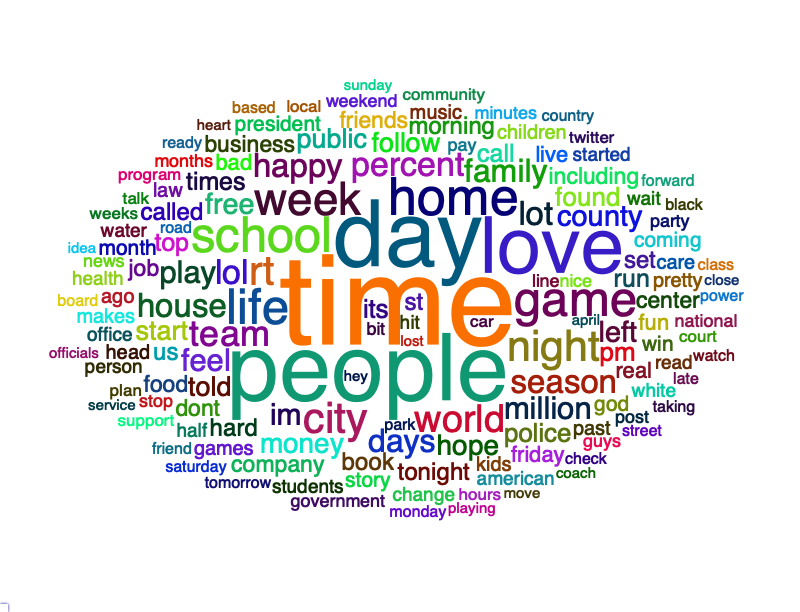
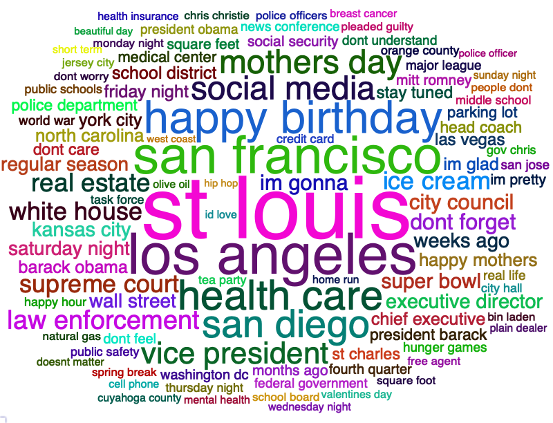
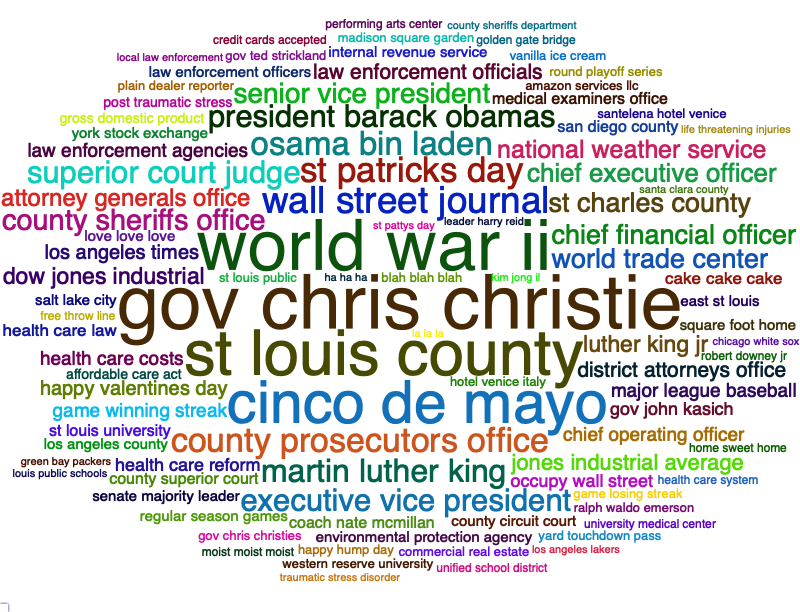

# Next word predictor with R and Python

This repo hosts the code for my next word predictor app using R for analysis and cleaning, and Python for modeling and deploying for my capstone project for the [Data Science Specialization by Johns Hopkins University](https://www.coursera.org/specializations/jhu-data-science).

Click [here](docs/corpora-info.md) for more information about the corpora used to build this model, and click [here](docs/project_overview.md) for an overview about the project.

## Data Analysis

### Dataset information

|  file_name  |   size   | line_count | word_count | max_line |
|:-----------:|:--------:|:----------:|:----------:|:--------:|
|  blogs.txt  | 200.4 MB |   899,288  | 37,334,690 |    140   |
|   news.txt  | 196.3 MB |  1,010,242 | 34,372,720 |  11,384  |
| twitter.txt | 159.4 MB |  2,360,148 | 30,374,206 |  40,833  |

### N-grams wordclouds

View the full report [here](https://benthecoder.github.io/JohnHopkinsDataScience/10_DataScienceCapstone/report/milestone-report.html)

## Model Building

In progress...

The plan is to build a markov chain and LSTM model with python

## Resources for NLP

- [Stanford Natural Language Processing course](https://web.stanford.edu/~jurafsky/NLPCourseraSlides.html)
- [Text Mining with R](https://www.tidytextmining.com/)
- [Natural Language Processing With R](https://blog.udacity.com/2020/10/natural-language-processing-with-r.html)
