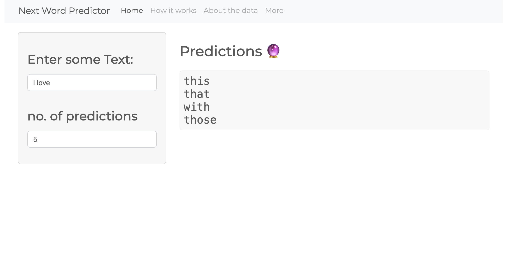
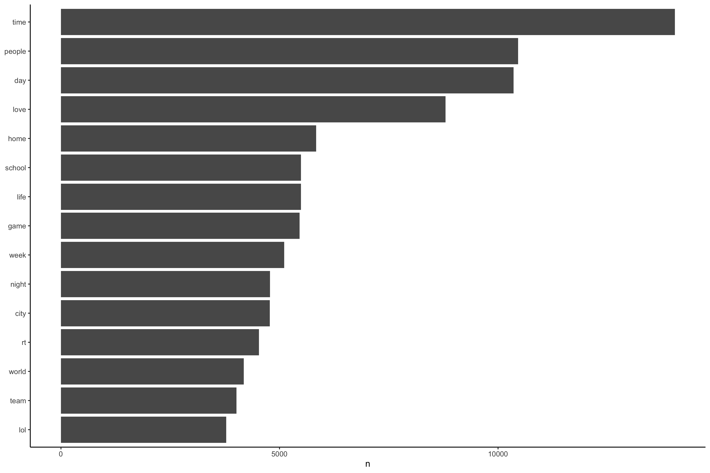
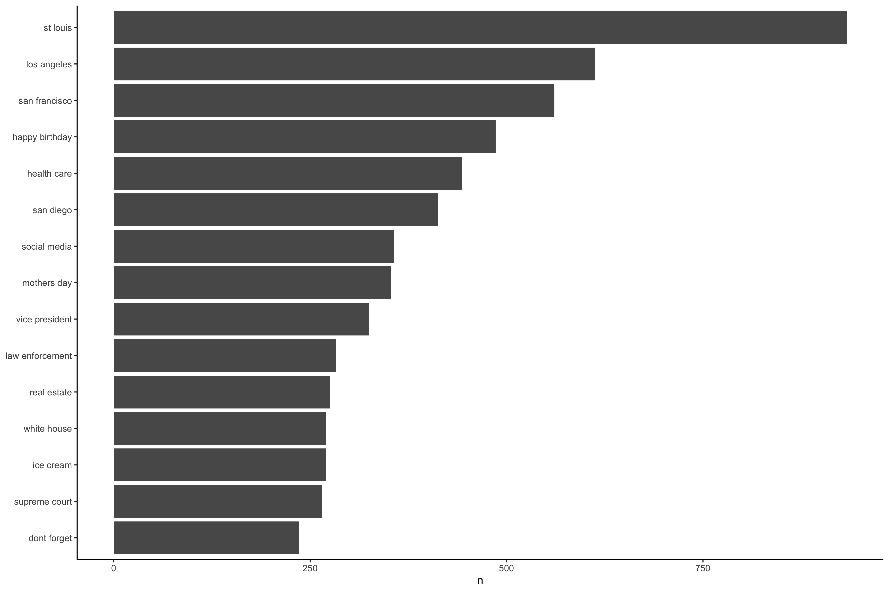
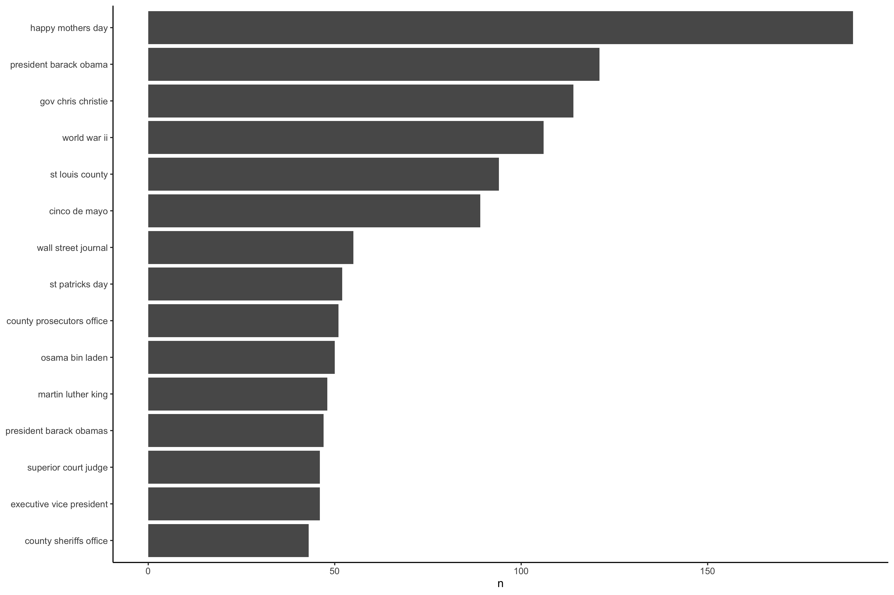

# Next word predictor with R and Python

This repo hosts the code for my next word predictor app using R for analysis and cleaning, and Python for modeling and deploying for my capstone project for the [Data Science Specialization by Johns Hopkins University](https://www.coursera.org/specializations/jhu-data-science).

Click [here](docs/corpora-info.md) for more information about the corpora used to build this model, and click [here](docs/project_overview.md) for an overview about the project.

## The app

## Data Analysis

### Dataset information

|  file_name  |   size   | line_count | word_count | max_line |
|:-----------:|:--------:|:----------:|:----------:|:--------:|
|  blogs.txt  | 200.4 MB |   899,288  | 37,334,690 |    140   |
|   news.txt  | 196.3 MB |  1,010,242 | 34,372,720 |  11,384  |
| twitter.txt | 159.4 MB |  2,360,148 | 30,374,206 |  40,833  |

### N-grams bar charts

### Ngrams wordclouds

View the full report [here](https://benthecoder.github.io/next-word-predictor/app/report/milestone-report.html)

You can find all the ngrams in the data folder.

## Model Building

The intial approach was to place ngrams in tibble format, and filter for the right strings. That approach was very expensive, and the shiny app was not able to run. The second approach was using the `markovchain` package to build markov models using the ngrams. The goal was to use back-off for the model, but due to the limitation of Shiny's free tier limitation, I was only able to use a small subset of the unigrams, which is 100mb (The initial model was 6bg) and the bigrams markov model was ~40GB. 

One way to improve this model is to use LSTM or transformers, which can give much more accurate predictions.

View the initial approach [here](https://benthecoder.github.io/next-word-predictor/app/report/predictionNgrams.html)

View the markov approach [here](https://benthecoder.github.io/next-word-predictor/app/report/markov-chain.html)

## Resources

### NLP

- [Stanford Natural Language Processing course](https://web.stanford.edu/~jurafsky/NLPCourseraSlides.html)
- [Text Mining with R](https://www.tidytextmining.com/)
- [Natural Language Processing With R](https://blog.udacity.com/2020/10/natural-language-processing-with-r.html)

### Markov Chain

- [Markov Chains explained visually](https://setosa.io/ev/markov-chains/)
- [Markov Chains by brilliant](https://brilliant.org/wiki/markov-chains/)

### LSTM and Transformers

- [colah.github.io LSTM](https://colah.github.io/posts/2015-08-Understanding-LSTMs/)
- [If you know SQL, you probably understand Transformer, BERT and GPT.](https://towardsdatascience.com/if-you-know-sql-you-probably-understand-transformer-bert-and-gpt-7b197cb48d24)
- [Attention? Attention!](https://lilianweng.github.io/lil-log/2018/06/24/attention-attention.html)
- [CS224N: Natural Language Processing with Deep Learning](https://www.youtube.com/playlist?list=PLoROMvodv4rOhcuXMZkNm7j3fVwBBY42z)

